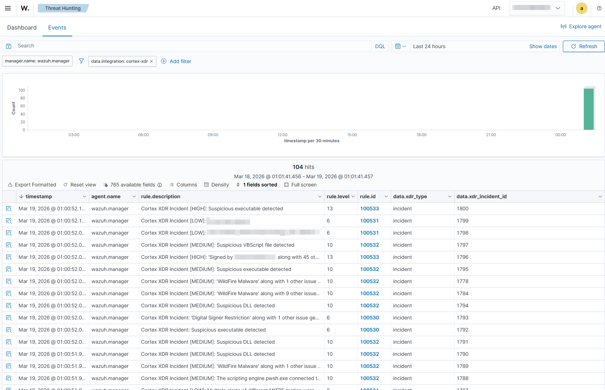

# Cortex XDR - Wazuh Integration

Wazuh wodle that ingests **alerts (issues)** and **incidents (cases)** from Palo Alto Networks Cortex XDR tenants into Wazuh SIEM via the Cortex XDR REST API.

---

## Dashboard



*Wazuh Threat Hunting dashboard filtered by integration `cortex-xdr`, showing ingested incidents with severity levels, rule IDs, and descriptions.*

---

## Features

- **Three ingestion modes** — `economy` (incidents only), `balanced` (incidents + high/critical alerts, default), `enriched` (full fidelity). Set once in `run.sh`.
- **Single wodle block** — one scheduled command captures the full incident lifecycle: new, under investigation, and closed. No duplicate API calls.
- **Stateful** — bookmarks last-seen timestamps per data type. Each run only pulls what changed. No duplicates.
- **Long-term archival** — Cortex does not retain data indefinitely. This integration persists all events in OpenSearch for compliance, forensics, and historical investigation.
- **MITRE ATT&CK tactic tagging** — incidents with tactic mappings are tagged with `mitre_*` groups for custom dashboard filtering.
- **Closed incident tracking** — resolved incidents are ingested as level 3 archival records.
- **Secure credential management** — FQDN, API key, and key ID stored in a restricted secrets file or systemd encrypted credentials.
- **Multi-tenant** — deploy a separate directory and `run.sh` per tenant.
- **Zero external Python dependencies** — stdlib only.

---

## Installation

1. Copy `wodle/*` to `/var/ossec/wodles/cortex-xdr/` on the Wazuh manager (or agent host).
2. Create `.secrets` from `.secrets.example` — set `XDR_FQDN`, `XDR_API_KEY`, `XDR_API_KEY_ID`. Set permissions `chmod 640, chown root:wazuh`. Edit `run.sh` — set `XDR_MODE` and other runtime config.
3. Copy `rules/cortex_xdr_rules.xml` → `/var/ossec/etc/rules/` and `rules/cortex_xdr_decoder.xml` → `/var/ossec/etc/decoders/`.
4. Add a wodle stanza to `/var/ossec/etc/ossec.conf` using the example in [artifacts/configs/ossec_cortex_xdr.conf](artifacts/configs/ossec_cortex_xdr.conf).
5. Restart Wazuh manager.

See [artifacts/configs/](artifacts/configs/) for ossec.conf examples and credential configuration. Docker Compose volume mappings are in [artifacts/overrides/](artifacts/overrides/).

---

## Repository structure

```
wazuh-cortex-xdr/
├── wodle/
│   ├── cortex_xdr.py            ← Entry point, CLI, mode system, orchestration
│   ├── cortex_xdr_alerts.py     ← Alert fetch, pagination, action filter
│   ├── cortex_xdr_incidents.py  ← Incident fetch, pagination, status filter, enrichment
│   ├── cortex_xdr_utils.py      ← Auth, HTTP, atomic state, emit, logging, secrets
│   ├── run.sh                   ← Runtime config wrapper (ossec.conf <command> target)
│   └── secrets.example         ← Credentials template (copy to .secrets)
├── rules/
│   ├── cortex_xdr_rules.xml     ← Custom Wazuh rules (IDs 100500–100599)
│   └── cortex_xdr_decoder.xml   ← JSON decoder registration
├── artifacts/
│   ├── configs/
│   │   ├── ossec_cortex_xdr.conf               ← ossec.conf wodle stanza examples
│   │   └── cortex-xdr-credentials.conf         ← systemd drop-in for encrypted credentials
│   ├── guides/
│   │   ├── configuration.md                    ← All env vars, CLI flags, modes, multi-tenant
│   │   ├── rules-reference.md                  ← Rule families, severity mapping, MITRE, compliance
│   │   └── troubleshooting.md                  ← Test commands, common errors, reset / backfill
│   ├── images/
│   │   └── wazuh_xdr_incidents_pv.png          ← Dashboard screenshot
│   └── overrides/
│       ├── docker-compose.single-node.override.yml ← Docker volume mapping (single-node)
│       └── docker-compose.multi-node.override.yml  ← Docker volume mapping (multi-node)
├── .gitignore
└── README.md
```

---

## Ingestion modes

| Mode | Incidents | Alerts | Enrichment | Use when |
|---|---|---|:---:|---|
| `economy` | All statuses | None | Off | Storage-constrained; incidents already aggregate alert data |
| `balanced` | All statuses | High + critical (all actions) | Off | **Recommended** for most environments |
| `enriched` | All statuses | All severities (all actions) | On | Full archival fidelity, compliance, forensic requirements |

Set the mode in `run.sh` via `XDR_MODE`, or pass `--mode` on the command line.
The default is `balanced`. Individual flags override the mode for a single run. See [configuration reference](artifacts/guides/configuration.md) for details.

---

## How it works

```
ossec.conf <wodle command>
    └─► run.sh  (sets XDR_MODE and runtime config; execs cortex_xdr.py)
            └─► cortex_xdr.py  (parses args, applies mode preset, loads state)
                    ├─► cortex_xdr_alerts.py     → api_post() → emit() → stdout
                    └─► cortex_xdr_incidents.py  → api_post() → emit() → stdout
                                                      ↑
                                          cortex_xdr_utils.py
                              (auth headers, HTTP, atomic state, emit, secrets)
                                          ↑
                          Secret priority chain (first match wins):
                          [systemd $CREDENTIALS_DIRECTORY]
                                    > [.secrets file]

stdout ──► Wazuh wodle manager ──► cortex_xdr_decoder.xml ──► cortex_xdr_rules.xml
                                                                       ↓
                                                           OpenSearch / Dashboard
```

Each event is emitted as a single JSON line. All XDR API fields are prefixed with `xdr_` to avoid collisions with Wazuh's reserved field names. Wazuh's JSON decoder flattens all fields into `data.*` for rule matching and dashboard display.

Epoch-millisecond timestamp fields returned by the Cortex XDR API are converted to ISO 8601 strings before emission (e.g. `1706540499609` → `"2024-01-29T18:41:39.609Z"`). This causes OpenSearch's dynamic field mapping to detect them as date fields automatically — no custom index template is required.

### Deployment topology

The wodle can run on three different hosts — the choice does not affect the wodle code itself:

- **Manager / master node** (default) — simplest to deploy.
- **Dedicated Wazuh agent host** — credentials never touch the manager; polling is independent of manager restarts and cluster failovers. The agent forwards events to the manager over the standard encrypted channel.
- **Existing agent on a connected host** — any agent host with network access to the Cortex XDR API (e.g. a SOAR server or jump host) can run the wodle with no additional infrastructure.

---

## Reference docs

- [Configuration reference](artifacts/guides/configuration.md) — all environment variables, CLI flags, mode overrides, multi-tenant setup
- [Rules reference](artifacts/guides/rules-reference.md) — rule families, severity mapping, MITRE ATT&CK, compliance groups
- [Troubleshooting](artifacts/guides/troubleshooting.md) — test commands, common errors, state reset, backfill
